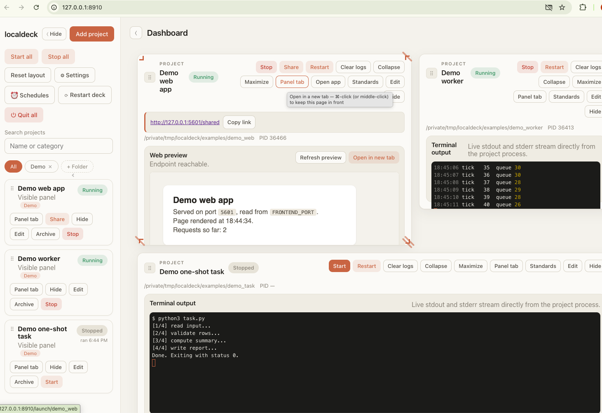
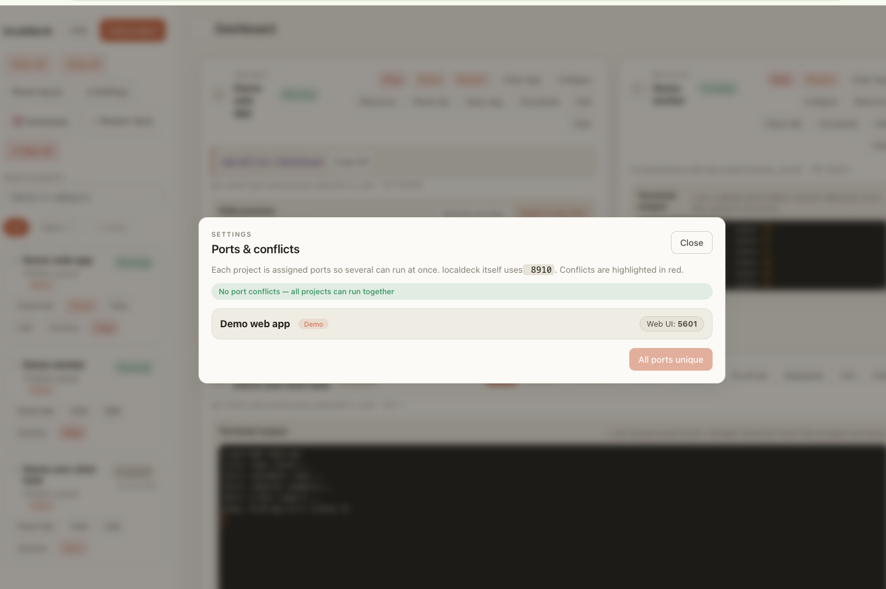
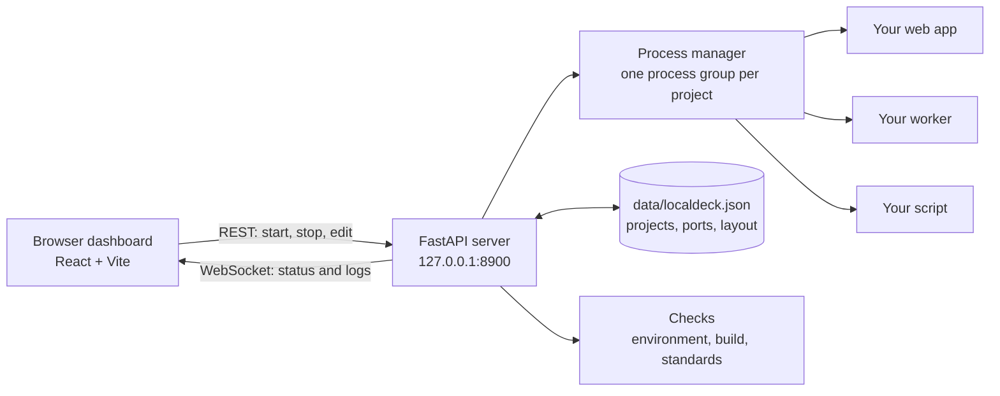

# localdeck

A local control panel for everything you run on your own machine. Register your web
apps, workers and scripts once, then start, stop, watch and open them from one browser
tab. localdeck gives each project its own ports, streams its terminal output live, and
warns you about the problems that usually cost an afternoon: a broken Python
environment, a browser showing an old build, or two apps fighting over one port.



## Why it exists

Once you have more than a handful of side projects, running them becomes its own job.
Which port does this one use? Is the other one still running in some forgotten
Terminal tab? Why does the UI still show yesterday's version? localdeck is the answer I
built for my own projects and use every day. Companies solve the same problem at a
larger scale with internal developer platforms; this is the single developer version.

## What it does

1. **Run anything with a start command.** Start, stop and restart each project from its
   own folder, in the same shell environment your Terminal uses. Stop ends the whole
   process tree and frees the project's ports, so nothing keeps running in the background.
2. **Assign ports without clashes.** Each project declares its ports, localdeck passes
   them in as environment variables (`BACKEND_PORT`, `FRONTEND_PORT`, or any name you
   choose), and the Settings view shows a port map with one click to resolve conflicts.
3. **Watch it live.** Every project gets a panel with an ANSI capable terminal and, for
   web apps, a live preview. Panels can be dragged, resized, maximized or opened in
   their own tab.
4. **Catch environment problems before you press Start.** localdeck reads each
   project's `pyvenv.cfg` and, on macOS, the Mach-O header of its interpreter, and says
   so when a virtualenv can no longer run on this machine.
5. **Catch stale builds.** It flags a web app whose built UI is older than its source,
   whose old bundles are still lying around, or whose HTML a browser is allowed to
   cache, and adds a build id to the URL it opens so a rebuilt app is never shown from
   cache.
6. **Check projects against a house standard.** The Standards button scans a project
   folder read only and returns a pass, warn or fail scorecard. It can write the fixes as
   a plan file inside that project for you or a coding agent to act on.
7. **Alternate start.** A project can offer a second labelled way to start (for example
   with a public tunnel). localdeck picks the address the app prints and shows it as a
   link.
8. **Scheduled jobs (macOS).** View your launchd jobs, run them now, pause, resume or
   reschedule them.



## Quick start

Requirements: Python 3.9 or newer (the `python3` that ships with macOS works) and
Node.js 18 or newer. macOS is the primary platform; the core also runs on Linux (the
launchd and Mach-O features are macOS only, and without zsh set
`LOCALDECK_SHELL=/bin/bash`).

```bash
git clone https://github.com/pouriaetab/localdeck.git
cd localdeck
./setup.sh      # backend virtualenv and frontend packages
./launch.sh     # builds the UI if needed, starts the server, opens the browser
```

The dashboard opens at `http://127.0.0.1:8900`. On first start it registers three demo
projects from `examples/` (a small web app, a long running worker and a one shot task)
so you can try everything before adding your own. Press `Ctrl+C` in the Terminal to stop
localdeck and every project it started.

Other entry points:

| Command | Purpose |
| --- | --- |
| `./launch.sh --rebuild` | Force a fresh UI build before starting |
| `./run-dev.sh` | Development mode: backend with reload plus the Vite dev server on port 5173 |
| `./localdeck.command` | Double click from Finder to launch in a Terminal window |
| `bash build_macos_app.sh` | Build a double clickable `localdeck.app` |

Environment variables: `LOCALDECK_PORT` (default 8900), `LOCALDECK_STATE_FILE`,
`LOCALDECK_SHELL` (default `/bin/zsh`), `LOCALDECK_NODE_BIN`, `LOCALDECK_NO_OPEN=1`.

## Adding your own project

Click **Add project** and fill in a name, the folder, the start command and, for a web
app, its URL and ports. Your list is saved to `data/localdeck.json`, which stays on your
machine and is ignored by git. `data/localdeck.example.json` shows every field,
including ports and an alternate start.

For a project to run next to others, have its start script read the ports localdeck
passes in and fall back to its own defaults when run by hand:

```bash
uvicorn app.main:app --port "${BACKEND_PORT:-8000}" &
npm run dev -- --port "${FRONTEND_PORT:-5173}"
```

## How it works



* **Backend** (`backend/app`): FastAPI serves the API, the WebSocket event stream and
  the built UI. `process_manager.py` starts each project in its own process group
  through a login shell, reads its output in bursts so a chatty process cannot flood
  the socket, and on Stop signals the whole group, force kills only if needed, then
  frees the project's ports.
* **Frontend** (`frontend/src`): React with `react-grid-layout` for the panels and
  `xterm.js` for the terminals.
* **State**: one JSON file, written atomically (temp file, then rename).

## Security model

localdeck runs the commands you configure, so it is built to answer only you:

* It listens on `127.0.0.1` only.
* It refuses any request whose `Host` header is not a loopback name, which blocks DNS
  rebinding attacks from web pages.
* It refuses state changing requests and WebSocket connections whose `Origin` is not
  local, which blocks cross site requests.
* It serves UI files only from inside the build folder, whatever the request path says.
* It never runs a command that is not already in your saved configuration.

These are covered by `backend/tests/test_security.py`. Treat `data/localdeck.json` like
code: anything in it will run on your machine when you press Start.

## Tests

```bash
cd backend
../.venv/bin/python -m pip install pytest
../.venv/bin/python -m pytest -q
```

The suite covers process lifecycle (duplicate start protection, live log capture,
killing child processes, output batching), the environment and build checks, the
standards rules, the launchd parser and the security guard. CI runs it on macOS and
Linux and builds the UI on every push.

## Lessons

[`LESSONS.md`](LESSONS.md) records the failures that no rule can check automatically,
from real incidents while building and using this tool. It is the most useful file here
if you build tools like this yourself.

## Related tools

If you need this at team scale, look at [Tilt](https://tilt.dev) (local multi service
development), [Overmind](https://github.com/DarthSim/overmind) or
[PM2](https://pm2.keymetrics.io) (process managers), and internal developer portals
such as [Backstage](https://backstage.io).

## License

MIT. See [LICENSE](LICENSE).
